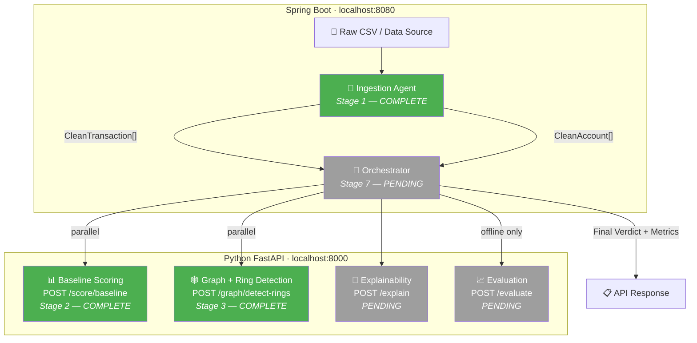

# Sentinel Ring — Project Synopsis

> **Track 2: AI Risk Manager** — Razorpay AI Buildathon
>
> A multi-agent fraud detection system that catches coordinated abuse rings
> by analyzing shared attributes (device, IP, bank account) across accounts,
> rather than scoring transactions individually.

---

## Current Status

| Stage | Agent | Stack | Status |
|-------|-------|-------|--------|
| 0 | API Contract | — | ✅ Locked (v4) |
| 1 | **Ingestion Agent** | **Spring Boot** | ✅ **Complete** |
| 2 | **Baseline Scoring Agent** | **Python** | ✅ **Complete** |
| 3 | **Graph-Builder & Ring-Detection Agent** | **Python** | ✅ **Complete** |
| 4 | Evaluation Agent | Python | ⏳ Pending |
| 5 | Evaluation Agent | Python | ⏳ Pending |
| 6 | Explainability Agent | Python | ⏳ Pending |
| 7 | Orchestrator (wiring) | Spring Boot | ⏳ Pending |

---

## Architecture — Current State



**Legend:** 🟢 Green = complete | ⬜ Grey = pending

---

## Stage 1: Ingestion Agent — What Was Built

### Purpose

The Ingestion Agent is the data-cleaning boundary of the system. Everything
upstream (raw CSVs, Kaggle data) is messy and potentially sensitive.
Everything downstream (Python ML agents) receives clean, normalized,
privacy-safe data.

### Key Design Decisions

| Decision | Choice | Rationale |
|----------|--------|-----------|
| Bank reference handling | SHA-256 hash via `BankRefHasher` | API contract requires non-reversible tokens. Raw bank data never leaves the Java side. |
| Null normalization | Blank/empty → explicit `null` | Contract rule: `null` is never treated as shared evidence in the graph. Two accounts with `null` device_id don't get connected. |
| Timestamp parsing | 3 strategies: ISO-8601, simple date, epoch seconds | Real data uses varied formats. IEEE-CIS uses epoch-style; other datasets use ISO dates. |
| Account deduplication | First non-null attribute wins | Raw data has one row per transaction but the graph needs one row per account. Merge by keeping first non-null value for each attribute. |
| Malformed row handling | Drop + log warning, don't crash | Graceful degradation: bad rows are counted in `skippedRows` for auditing. |
| Immutable DTOs | `final` fields, no setters on clean DTOs | Clean data should never be mutated after construction. |

### Output Shapes (per API Contract v3)

**CleanTransaction** → sent to `/score/baseline`:
```json
{ "id": "t1", "amount": 4500, "device_id": "d1", "ip": "1.2.3.4", "account_id": "a1" }
```

**CleanAccount** → sent to `/graph/detect-rings`:
```json
{ "account_id": "a1", "device_id": "d1", "ip": "1.2.3.4", "bank_ref": "a3f2b7c9..." }
```

### Test Coverage

| Test Category | Count | What's Tested |
|---------------|-------|---------------|
| Null normalization | 4 | Empty/blank device_id, ip, bankAccount → null; valid values preserved |
| Bank-ref hashing | 2 | SHA-256 output matches, same bank → same hash |
| Malformed rows | 4 | Missing id/amount/accountId skipped; mix of valid+invalid; empty input |
| Timestamp parsing | 5 | ISO-8601, simple date, epoch seconds, invalid (ignored), range tracking |
| Account deduplication | 2 | Same accountId → one output; first non-null attribute wins |
| Defense-only | 1 | IngestionResult has no scoring/flagging fields |

### Files

| File | Purpose |
|------|---------|
| [`pom.xml`](file:///c:/Users/yusuf/OneDrive/Desktop/RazorPay%20AI%20Risk%20Mg/orchestrator/pom.xml) | Maven project config (Spring Boot 3.3, Java 17) |
| [`SentinelApplication.java`](file:///c:/Users/yusuf/OneDrive/Desktop/RazorPay%20AI%20Risk%20Mg/orchestrator/src/main/java/com/sentinel/SentinelApplication.java) | Spring Boot entry point |
| [`RawTransaction.java`](file:///c:/Users/yusuf/OneDrive/Desktop/RazorPay%20AI%20Risk%20Mg/orchestrator/src/main/java/com/sentinel/ingestion/dto/RawTransaction.java) | Raw input DTO (internal only) |
| [`CleanTransaction.java`](file:///c:/Users/yusuf/OneDrive/Desktop/RazorPay%20AI%20Risk%20Mg/orchestrator/src/main/java/com/sentinel/ingestion/dto/CleanTransaction.java) | Cleaned transaction DTO (for /score/baseline) |
| [`CleanAccount.java`](file:///c:/Users/yusuf/OneDrive/Desktop/RazorPay%20AI%20Risk%20Mg/orchestrator/src/main/java/com/sentinel/ingestion/dto/CleanAccount.java) | Cleaned account DTO (for /graph/detect-rings) |
| [`IngestionResult.java`](file:///c:/Users/yusuf/OneDrive/Desktop/RazorPay%20AI%20Risk%20Mg/orchestrator/src/main/java/com/sentinel/ingestion/dto/IngestionResult.java) | Ingestion output wrapper |
| [`BankRefHasher.java`](file:///c:/Users/yusuf/OneDrive/Desktop/RazorPay%20AI%20Risk%20Mg/orchestrator/src/main/java/com/sentinel/ingestion/util/BankRefHasher.java) | SHA-256 bank reference hasher |
| [`IngestionService.java`](file:///c:/Users/yusuf/OneDrive/Desktop/RazorPay%20AI%20Risk%20Mg/orchestrator/src/main/java/com/sentinel/ingestion/service/IngestionService.java) | Core ingestion logic |
| [`BankRefHasherTest.java`](file:///c:/Users/yusuf/OneDrive/Desktop/RazorPay%20AI%20Risk%20Mg/orchestrator/src/test/java/com/sentinel/ingestion/util/BankRefHasherTest.java) | Hash utility tests |
| [`IngestionServiceTest.java`](file:///c:/Users/yusuf/OneDrive/Desktop/RazorPay%20AI%20Risk%20Mg/orchestrator/src/test/java/com/sentinel/ingestion/service/IngestionServiceTest.java) | Ingestion service tests (18 tests) |

---

## Defense-Only Commitment

> ⚠️ **This system only flags and explains.** It never auto-blocks, auto-bans,
> or takes autonomous action against any account. A human operator reviews
> every flag before any action is taken. The Ingestion Agent specifically
> performs **zero** decision-making — it only cleans and normalizes data.

---

## Stage 2: Baseline Scoring Agent — What Was Built

### Purpose

The Baseline Scoring Agent is the first Python agent and the first endpoint
that the Spring Boot Orchestrator will call. It takes the `CleanTransaction[]`
from the Ingestion Agent and returns a risk score (0.0–1.0) per transaction.
This is the "quick first pass" — catching individually suspicious
transactions before the graph analysis looks for coordinated rings.

### Key Design Decisions

| Decision | Choice | Rationale |
|----------|--------|-----------|
| Scoring approach (v1) | Rule-based heuristic (sigmoid on amount + missing-attribute penalties) | No training data loaded yet. This gives a working pipeline now; swap to trained ML model later without changing the API shape. |
| Amount → risk mapping | Logistic sigmoid curve | Avoids naive "big = bad." Low amounts contribute almost zero risk; mid-range is where the jump matters most; very high amounts plateau. |
| Missing device/IP | Additive penalty weights (0.25 / 0.15) | Legitimate users usually have trackable devices and IPs. Missing signals are suspicious but not conclusive alone. |
| Score clamping | `max(0.0, min(1.0, score))` | Contract requires [0.0, 1.0] range. Clamping guarantees this regardless of weight tuning. |
| Framework | FastAPI + Pydantic | Pydantic handles request validation + JSON serialization in one class (vs. DTO + Jackson + @Valid in Spring Boot). Auto-generates Swagger docs at `/docs`. |
| Project structure | `scoring/` package with models, scorer, router | Same separation as Spring Boot (DTO / Service / Controller) but in Python modules. |

### Scoring Heuristic (v1)

```
risk = 0.05 (base)
     + sigmoid(amount) × 0.50   (amount signal)
     + 0.25 if device_id is null (missing device penalty)
     + 0.15 if ip is null         (missing IP penalty)

clamped to [0.0, 1.0]
```

### Test Coverage (17 tests)

| Test Category | Count | What's Tested |
|---------------|-------|---------------|
| Scorer logic | 9 | Low amount → low score, high amount → higher, missing device/IP increases score, extreme values clamped, batch IDs match |
| API endpoint | 8 | Valid 200 response, correct JSON shape, score in range, batch support, null fields accepted, empty → 400, missing field → 422, snake_case field names |

### Files

| File | Purpose |
|------|---------|
| [`requirements.txt`](file:///c:/Users/yusuf/OneDrive/Desktop/RazorPay%20AI%20Risk%20Mg/agents/requirements.txt) | Python dependencies (FastAPI, Pydantic, pytest, etc.) |
| [`main.py`](file:///c:/Users/yusuf/OneDrive/Desktop/RazorPay%20AI%20Risk%20Mg/agents/main.py) | FastAPI entry point — registers all routers |
| [`scoring/models.py`](file:///c:/Users/yusuf/OneDrive/Desktop/RazorPay%20AI%20Risk%20Mg/agents/scoring/models.py) | Pydantic request/response models for /score/baseline |
| [`scoring/scorer.py`](file:///c:/Users/yusuf/OneDrive/Desktop/RazorPay%20AI%20Risk%20Mg/agents/scoring/scorer.py) | Scoring heuristic logic (v1, rule-based) |
| [`scoring/router.py`](file:///c:/Users/yusuf/OneDrive/Desktop/RazorPay%20AI%20Risk%20Mg/agents/scoring/router.py) | FastAPI router for POST /score/baseline |
| [`tests/test_scoring.py`](file:///c:/Users/yusuf/OneDrive/Desktop/RazorPay%20AI%20Risk%20Mg/agents/tests/test_scoring.py) | 17 tests — scorer logic + endpoint integration |

---

## Stage 3: Graph-Builder & Ring-Detection Agent — What Was Built

### Purpose

The Graph-Builder & Ring-Detection Agent implements `POST /graph/detect-rings`.
It receives account attribute sets (`device_ids`, `ips`, `bank_refs`), constructs
an undirected NetworkX graph connecting accounts that share non-null attributes,
identifies connected components (clusters), and computes confidence scores for
flagged rings.

### Key Data-Model Correction (API Contract v4)

| Original Approach | Problem | Revised Approach (v4) |
|-------------------|---------|-----------------------|
| Deduplicate account attributes by keeping first non-null value (`device_id`, `ip`, `bank_ref`). | Discarded subsequent legitimate devices/IPs/banks used by the same account, missing graph links. | Preserve **all** observed non-null attribute values as sets per account (`device_ids`, `ips`, `bank_refs`). |

### Key Design Decisions

| Decision | Choice | Rationale |
|----------|--------|-----------|
| Graph Library | `networkx` (`nx.Graph`) | Standard Python library for graph construction and connected component detection. |
| Edge Rules | Created only between accounts sharing non-null/non-empty attribute values. | Prevents false connections from unobserved attributes. |
| Edge Data | `shared_attrs` set stored on each edge (`device_id`, `ip`, `bank_ref`). | Preserves attribute-level evidence trail for downstream explanations. |
| Ring Ordering | Primary: descending `ring_score`. Secondary tie-breaker: `account_ids` joined string. | Guarantees deterministic output across identical input payloads. |
| Ring ID Format | `ring-1`, `ring-2`, ... (1-based rank by descending score). | Consistent run-scoped ring IDs. |

### Test Coverage (8 tests)

| Test Category | Count | What's Tested |
|---------------|-------|---------------|
| Null/Empty handling | 1 | Accounts with empty attribute sets create no graph edges |
| Disconnected accounts | 1 | Accounts with unique attributes produce 0 rings |
| Single shared attribute | 1 | 3 accounts sharing device_id form 1 ring ("ring-1") |
| Multi-attribute linkage | 1 | Accounts linked across device + bank_ref preserve all evidence |
| Deterministic ordering | 1 | Rings sorted by score descending; tie-breaking rule verified |
| API integration | 3 | HTTP 200 with correct JSON shape, 400 for empty accounts, 422 for bad payload |

### Files

| File | Purpose |
|------|---------|
| [`agents/graph/models.py`](file:///c:/Users/yusuf/OneDrive/Desktop/RazorPay%20AI%20Risk%20Mg/agents/graph/models.py) | Pydantic models for /graph/detect-rings (v4) |
| [`agents/graph/detector.py`](file:///c:/Users/yusuf/OneDrive/Desktop/RazorPay%20AI%20Risk%20Mg/agents/graph/detector.py) | NetworkX graph construction & ring detection algorithm |
| [`agents/graph/router.py`](file:///c:/Users/yusuf/OneDrive/Desktop/RazorPay%20AI%20Risk%20Mg/agents/graph/router.py) | FastAPI router for POST /graph/detect-rings |
| [`agents/tests/test_graph.py`](file:///c:/Users/yusuf/OneDrive/Desktop/RazorPay%20AI%20Risk%20Mg/agents/tests/test_graph.py) | 8 unit & integration tests for ring detection |

---

## What's Next

**Stage 4: Evaluation Agent (Python / FastAPI)**
- Implements `POST /evaluate`
- Computes precision, recall, and false-positive cost on held-out test sets
- Validates prediction vs ground truth ID alignment rules

---

## Metrics

> Precision, recall, and false-positive cost will be reported here once the
> Evaluation Agent (Stage 5) is running against real train/test data. No
> placeholder or estimated numbers.
