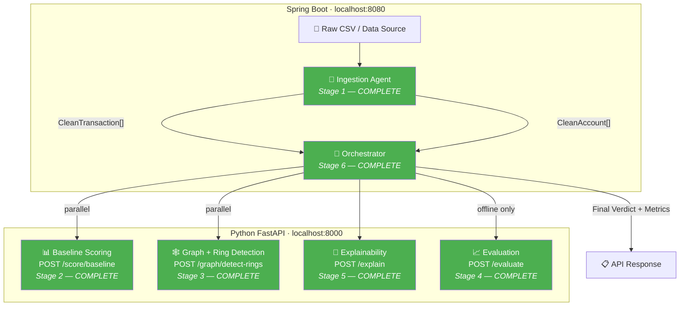

# Sentinel Ring — Project Synopsis

> **Track 2: AI Risk Manager** — Razorpay AI Buildathon
>
> A multi-agent fraud detection system that catches coordinated abuse rings
> by analyzing shared attributes (device, IP, bank account) across accounts,
> rather than scoring transactions individually.

---

## Current Status

| Stage | Agent | Stack | Status |
|-------|-------|-------|--------|
| 0 | API Contract | — | ✅ Locked (v4) |
| 1 | **Ingestion Agent** | **Spring Boot** | ✅ **Complete** |
| 2 | **Baseline Scoring Agent** | **Python** | ✅ **Complete** |
| 3 | **Graph-Builder & Ring-Detection Agent** | **Python** | ✅ **Complete (Louvain)** |
| 4 | **Evaluation Agent** | **Python** | ✅ **Complete** |
| 5 | **Explainability Agent** | **Python** | ✅ **Complete** |
| 6 | **Orchestrator (wiring)** | **Spring Boot** | ✅ **Complete** |

---

## Architecture — Current State



**Legend:** 🟢 Green = complete | ⬜ Grey = pending

---

## Stage 1: Ingestion Agent — What Was Built

### Purpose

The Ingestion Agent is the data-cleaning boundary of the system. Everything
upstream (raw CSVs, Kaggle data) is messy and potentially sensitive.
Everything downstream (Python ML agents) receives clean, normalized,
privacy-safe data.

### Key Design Decisions

| Decision | Choice | Rationale |
|----------|--------|-----------|
| Bank reference handling | SHA-256 hash via `BankRefHasher` | API contract requires non-reversible tokens. Raw bank data never leaves the Java side. |
| Null normalization | Blank/empty → explicit `null` | Contract rule: `null` is never treated as shared evidence in the graph. Two accounts with `null` device_id don't get connected. |
| Timestamp parsing | 3 strategies: ISO-8601, simple date, epoch seconds | Real data uses varied formats. IEEE-CIS uses epoch-style; other datasets use ISO dates. |
| Account attribute aggregation | Preserve all observed non-null sets per account (`device_ids`, `ips`, `bank_refs`) | Preserves full graph linkage evidence across multiple transactions for the same account. |
| Malformed row handling | Drop + log warning, don't crash | Graceful degradation: bad rows are counted in `skippedRows` for auditing. |
| Immutable DTOs | `final` fields, no setters on clean DTOs | Clean data should never be mutated after construction. |

### Output Shapes (per API Contract v4)

**CleanTransaction** → sent to `/score/baseline`:
```json
{ "id": "t1", "amount": 4500, "device_id": "d1", "ip": "1.2.3.4", "account_id": "a1" }
```

**CleanAccount** → sent to `/graph/detect-rings`:
```json
{ "account_id": "a1", "device_ids": ["d1"], "ips": ["1.2.3.4"], "bank_refs": ["a3f2b7c9..."] }
```

### Test Coverage

| Test Category | Count | What's Tested |
|---------------|-------|---------------|
| Null normalization | 4 | Empty/blank device_id, ip, bankAccount → null; valid values preserved |
| Bank-ref hashing | 2 | SHA-256 output matches, same bank → same hash |
| Malformed rows | 4 | Missing id/amount/accountId skipped; mix of valid+invalid; empty input |
| Timestamp parsing | 5 | ISO-8601, simple date, epoch seconds, invalid (ignored), range tracking |
| Account deduplication & aggregation | 2 | Same accountId → aggregate sets of all non-null devices, IPs, and bank refs |
| Defense-only | 1 | IngestionResult has no scoring/flagging fields |

### Files

| File | Purpose |
|------|---------|
| [`pom.xml`](file:///c:/Users/yusuf/OneDrive/Desktop/RazorPay%20AI%20Risk%20Mg/orchestrator/pom.xml) | Maven project config (Spring Boot 3.3, Java 17) |
| [`SentinelApplication.java`](file:///c:/Users/yusuf/OneDrive/Desktop/RazorPay%20AI%20Risk%20Mg/orchestrator/src/main/java/com/sentinel/SentinelApplication.java) | Spring Boot entry point |
| [`RawTransaction.java`](file:///c:/Users/yusuf/OneDrive/Desktop/RazorPay%20AI%20Risk%20Mg/orchestrator/src/main/java/com/sentinel/ingestion/dto/RawTransaction.java) | Raw input DTO (internal only) |
| [`CleanTransaction.java`](file:///c:/Users/yusuf/OneDrive/Desktop/RazorPay%20AI%20Risk%20Mg/orchestrator/src/main/java/com/sentinel/ingestion/dto/CleanTransaction.java) | Cleaned transaction DTO (for /score/baseline) |
| [`CleanAccount.java`](file:///c:/Users/yusuf/OneDrive/Desktop/RazorPay%20AI%20Risk%20Mg/orchestrator/src/main/java/com/sentinel/ingestion/dto/CleanAccount.java) | Cleaned account DTO (for /graph/detect-rings) |
| [`IngestionResult.java`](file:///c:/Users/yusuf/OneDrive/Desktop/RazorPay%20AI%20Risk%20Mg/orchestrator/src/main/java/com/sentinel/ingestion/dto/IngestionResult.java) | Ingestion output wrapper |
| [`BankRefHasher.java`](file:///c:/Users/yusuf/OneDrive/Desktop/RazorPay%20AI%20Risk%20Mg/orchestrator/src/main/java/com/sentinel/ingestion/util/BankRefHasher.java) | SHA-256 bank reference hasher |
| [`IngestionService.java`](file:///c:/Users/yusuf/OneDrive/Desktop/RazorPay%20AI%20Risk%20Mg/orchestrator/src/main/java/com/sentinel/ingestion/service/IngestionService.java) | Core ingestion logic |
| [`BankRefHasherTest.java`](file:///c:/Users/yusuf/OneDrive/Desktop/RazorPay%20AI%20Risk%20Mg/orchestrator/src/test/java/com/sentinel/ingestion/util/BankRefHasherTest.java) | Hash utility tests |
| [`IngestionServiceTest.java`](file:///c:/Users/yusuf/OneDrive/Desktop/RazorPay%20AI%20Risk%20Mg/orchestrator/src/test/java/com/sentinel/ingestion/service/IngestionServiceTest.java) | Ingestion service tests (18 tests) |

---

## Defense-Only Commitment

> ⚠️ **This system only flags and explains.** It never auto-blocks, auto-bans,
> or takes autonomous action against any account. A human operator reviews
> every flag before any action is taken. The Ingestion Agent specifically
> performs **zero** decision-making — it only cleans and normalizes data.

---

## Stage 2: Baseline Scoring Agent — What Was Built

### Purpose

The Baseline Scoring Agent is the first Python agent and the first endpoint
that the Spring Boot Orchestrator will call. It takes the `CleanTransaction[]`
from the Ingestion Agent and returns a risk score (0.0–1.0) per transaction.
This is the "quick first pass" — catching individually suspicious
transactions before the graph analysis looks for coordinated rings.

### Key Design Decisions

| Decision | Choice | Rationale |
|----------|--------|-----------|
| Scoring approach (v1) | Rule-based heuristic (sigmoid on amount + missing-attribute penalties) | No training data loaded yet. This gives a working pipeline now; swap to trained ML model later without changing the API shape. |
| Amount → risk mapping | Logistic sigmoid curve | Avoids naive "big = bad." Low amounts contribute almost zero risk; mid-range is where the jump matters most; very high amounts plateau. |
| Missing device/IP | Additive penalty weights (0.25 / 0.15) | Legitimate users usually have trackable devices and IPs. Missing signals are suspicious but not conclusive alone. |
| Score clamping | `max(0.0, min(1.0, score))` | Contract requires [0.0, 1.0] range. Clamping guarantees this regardless of weight tuning. |
| Framework | FastAPI + Pydantic | Pydantic handles request validation + JSON serialization in one class (vs. DTO + Jackson + @Valid in Spring Boot). Auto-generates Swagger docs at `/docs`. |
| Project structure | `scoring/` package with models, scorer, router | Same separation as Spring Boot (DTO / Service / Controller) but in Python modules. |

### Scoring Heuristic (v1)

```
risk = 0.05 (base)
     + sigmoid(amount) × 0.50   (amount signal)
     + 0.25 if device_id is null (missing device penalty)
     + 0.15 if ip is null         (missing IP penalty)

clamped to [0.0, 1.0]
```

### Test Coverage (17 tests)

| Test Category | Count | What's Tested |
|---------------|-------|---------------|
| Scorer logic | 9 | Low amount → low score, high amount → higher, missing device/IP increases score, extreme values clamped, batch IDs match |
| API endpoint | 8 | Valid 200 response, correct JSON shape, score in range, batch support, null fields accepted, empty → 400, missing field → 422, snake_case field names |

### Files

| File | Purpose |
|------|---------|
| [`requirements.txt`](file:///c:/Users/yusuf/OneDrive/Desktop/RazorPay%20AI%20Risk%20Mg/agents/requirements.txt) | Python dependencies (FastAPI, Pydantic, pytest, etc.) |
| [`main.py`](file:///c:/Users/yusuf/OneDrive/Desktop/RazorPay%20AI%20Risk%20Mg/agents/main.py) | FastAPI entry point — registers all routers |
| [`scoring/models.py`](file:///c:/Users/yusuf/OneDrive/Desktop/RazorPay%20AI%20Risk%20Mg/agents/scoring/models.py) | Pydantic request/response models for /score/baseline |
| [`scoring/scorer.py`](file:///c:/Users/yusuf/OneDrive/Desktop/RazorPay%20AI%20Risk%20Mg/agents/scoring/scorer.py) | Scoring heuristic logic (v1, rule-based) |
| [`scoring/router.py`](file:///c:/Users/yusuf/OneDrive/Desktop/RazorPay%20AI%20Risk%20Mg/agents/scoring/router.py) | FastAPI router for POST /score/baseline |
| [`tests/test_scoring.py`](file:///c:/Users/yusuf/OneDrive/Desktop/RazorPay%20AI%20Risk%20Mg/agents/tests/test_scoring.py) | 17 tests — scorer logic + endpoint integration |

---

## Stage 3: Graph-Builder & Ring-Detection Agent — What Was Built

### Purpose

The Graph-Builder & Ring-Detection Agent implements `POST /graph/detect-rings`.
It receives account attribute sets (`device_ids`, `ips`, `bank_refs`), constructs
an weighted NetworkX graph connecting accounts that share non-null attributes,
applies Louvain Community Detection to uncover tightly connected fraud rings,
and computes confidence scores for flagged rings.

### Graph & Clustering Safeguards (Louvain Community Detection)

| Feature | Implementation | Rationale |
|---------|----------------|-----------|
| Algorithm | `networkx.algorithms.community.louvain_communities` with `seed=42` | Ensures deterministic, reproducible community clustering across runs. |
| Edge Weighting | `device_id` = 3, `bank_ref` = 2, `ip` = 1 | Stronger linkage signals drive community formation over weak signals. |
| Minimum Ring Size | `min_ring_size = 3` | Weak 2-account pairs are discarded as rings. |
| Public IP Safeguard | Rings supported solely by shared IP are capped at `ring_score = 0.55` | Shared IP alone cannot trigger the `0.60` ring flagging threshold. |

### Ring Scoring Formula

```
base_score = 0.40
+ 0.25 if bank_ref is shared
+ 0.20 if device_id is shared
+ 0.05 if ip is shared
+ 0.05 * (cluster_size - 3) for size > 3
capped at 0.55 if shared_attrs == ["ip"]
clamped to [0.0, 1.0]
```

### Test Coverage (8 tests)

| Test Category | Count | What's Tested |
|---------------|-------|---------------|
| Null/Empty handling | 1 | Accounts with empty attribute sets create no graph edges |
| Disconnected accounts | 1 | Accounts with unique attributes produce 0 rings |
| Single shared attribute | 1 | 3 accounts sharing device_id form 1 ring ("ring-1") |
| Multi-attribute linkage | 1 | Accounts linked across device + bank_ref preserve all evidence |
| Deterministic ordering | 1 | Rings sorted by score descending; tie-breaking rule verified |
| API integration | 3 | HTTP 200 with correct JSON shape, 400 for empty accounts, 422 for bad payload |

### Files

| File | Purpose |
|------|---------|
| [`agents/graph/models.py`](file:///c:/Users/yusuf/OneDrive/Desktop/RazorPay%20AI%20Risk%20Mg/agents/graph/models.py) | Pydantic models for /graph/detect-rings (v4) |
| [`agents/graph/detector.py`](file:///c:/Users/yusuf/OneDrive/Desktop/RazorPay%20AI%20Risk%20Mg/agents/graph/detector.py) | NetworkX graph construction & ring detection algorithm |
| [`agents/graph/router.py`](file:///c:/Users/yusuf/OneDrive/Desktop/RazorPay%20AI%20Risk%20Mg/agents/graph/router.py) | FastAPI router for POST /graph/detect-rings |
| [`agents/tests/test_graph.py`](file:///c:/Users/yusuf/OneDrive/Desktop/RazorPay%20AI%20Risk%20Mg/agents/tests/test_graph.py) | 8 unit & integration tests for ring detection |

---

## Stage 4: Evaluation Agent — What Was Built

### Purpose

The Evaluation Agent implements `POST /evaluate`.
It compares flagged account predictions against held-out ground truth labels,
calculating precision, recall, and an estimated false-positive cost based on a
configurable cost per false positive.

### Key Design Decisions

| Decision | Choice | Rationale |
|----------|--------|-----------|
| Alignment Verification | Strict ID set comparison | Returns HTTP 400 if predictions and ground truth IDs do not match 1-to-1. |
| Unique ID Rule | Raises error on duplicate IDs | Prevents duplicate prediction counts or inflated metric calculations. |
| Vacuous Precision | `precision = 1.0` when no items flagged | Handles zero-flagged edge cases deterministically. |
| Vacuous Recall | `recall = 1.0` when 0 fraud items in ground truth | Standard metric behavior for empty-fraud ground truth sets. |
| Cost Calculation | `FP * cost_per_false_positive` | Simple, configurable dollar-cost estimation for false flags. |

### Test Coverage (6 tests)

| Test Category | Count | What's Tested |
|---------------|-------|---------------|
| Metric calculation | 2 | Standard TP/FP/TN/FN metrics and vacuous precision edge cases |
| Alignment & Validation | 2 | Raises 400/error on mismatched IDs or duplicate IDs |
| API integration | 2 | Endpoint 200 response shape and 400 mismatch error |

### Files

| File | Purpose |
|------|---------|
| [`agents/eval/models.py`](file:///c:/Users/yusuf/OneDrive/Desktop/RazorPay%20AI%20Risk%20Mg/agents/eval/models.py) | Pydantic models for /evaluate |
| [`agents/eval/evaluator.py`](file:///c:/Users/yusuf/OneDrive/Desktop/RazorPay%20AI%20Risk%20Mg/agents/eval/evaluator.py) | Metric computation and ID alignment logic |
| [`agents/eval/router.py`](file:///c:/Users/yusuf/OneDrive/Desktop/RazorPay%20AI%20Risk%20Mg/agents/eval/router.py) | FastAPI router for POST /evaluate |
| [`agents/tests/test_eval.py`](file:///c:/Users/yusuf/OneDrive/Desktop/RazorPay%20AI%20Risk%20Mg/agents/tests/test_eval.py) | 6 unit & integration tests for evaluation agent |

---

## Stage 5: Explainability Agent — What Was Built

### Purpose

The Explainability Agent implements `POST /explain`.
It takes a flagged ring's metadata (ring_id, account_ids, shared_attrs, optional
time_window_days) and generates a plain-English evidence explanation for human
reviewers. Only references time windows when timestamp data was actually available.

### Key Design Decisions

| Decision | Choice | Rationale |
|----------|--------|-----------|
| Attribute labeling | Map internal names to human-readable (`device_id` → "device fingerprint") | Makes explanations readable for non-technical fraud reviewers. |
| Time window handling | Only include when `time_window_days > 0` | Contract rule: never claim time-based evidence when timestamps were unavailable. |
| Oxford comma | Used for 3+ attributes | Grammatically correct English output. |

### Test Coverage (10 tests)

| Test Category | Count | What's Tested |
|---------------|-------|---------------|
| Explanation logic | 6 | Single attr, multiple attrs, oxford comma, time window present/null/zero |
| API integration | 4 | Valid 200 response, empty accounts 400, empty attrs 400, missing time_window |

### Files

| File | Purpose |
|------|---------|
| [`agents/explain/models.py`](file:///c:/Users/yusuf/OneDrive/Desktop/RazorPay%20AI%20Risk%20Mg/agents/explain/models.py) | Pydantic models for /explain |
| [`agents/explain/explainer.py`](file:///c:/Users/yusuf/OneDrive/Desktop/RazorPay%20AI%20Risk%20Mg/agents/explain/explainer.py) | Explanation text generator |
| [`agents/explain/router.py`](file:///c:/Users/yusuf/OneDrive/Desktop/RazorPay%20AI%20Risk%20Mg/agents/explain/router.py) | FastAPI router for POST /explain |
| [`agents/tests/test_explain.py`](file:///c:/Users/yusuf/OneDrive/Desktop/RazorPay%20AI%20Risk%20Mg/agents/tests/test_explain.py) | 10 unit & integration tests |

---

## Stage 6: Orchestrator Wiring — What Was Built

### Purpose

The Orchestrator is a Spring Boot REST controller (`POST /api/analyze`) that
wires all agents together into a single end-to-end pipeline:

```
Raw Transactions → Ingestion → [Scoring + Graph Detection in parallel]
                 → Explain (per flagged ring) → Final Verdict
                 → Evaluate (if ground truth supplied)
```

### Key Design Decisions

| Decision | Choice | Rationale |
|----------|--------|-----------|
| Python HTTP client | `java.net.http.HttpClient` (JDK 11+) | Built into JDK. |
| Scoring + Graph | Called in parallel via `ExecutorService` | Independent steps, parallel execution cuts latency. |
| Null preservation | Pass explicit JSON `null` for missing device/IP | Prevents silent lowering of risk scores on missing data. |
| Per-ring time window | Computed only across member accounts of that ring | Accurate temporal context per ring; omitted if span is 0 or missing. |
| Error propagation | Propagates `/evaluate` failures when ground truth is supplied | Prevents masking evaluation errors as `metrics: null`. |

### Files

| File | Purpose |
|------|---------|
| [`AnalyzeRequest.java`](file:///c:/Users/yusuf/OneDrive/Desktop/RazorPay%20AI%20Risk%20Mg/orchestrator/src/main/java/com/sentinel/orchestrator/dto/AnalyzeRequest.java) | Request DTO (transactions + optional ground truth) |
| [`VerdictItem.java`](file:///c:/Users/yusuf/OneDrive/Desktop/RazorPay%20AI%20Risk%20Mg/orchestrator/src/main/java/com/sentinel/orchestrator/dto/VerdictItem.java) | Single verdict entry DTO |
| [`MetricsResult.java`](file:///c:/Users/yusuf/OneDrive/Desktop/RazorPay%20AI%20Risk%20Mg/orchestrator/src/main/java/com/sentinel/orchestrator/dto/MetricsResult.java) | Metrics DTO (precision, recall, cost) |
| [`OrchestratorResponse.java`](file:///c:/Users/yusuf/OneDrive/Desktop/RazorPay%20AI%20Risk%20Mg/orchestrator/src/main/java/com/sentinel/orchestrator/dto/OrchestratorResponse.java) | Final response wrapper |
| [`PythonAgentClient.java`](file:///c:/Users/yusuf/OneDrive/Desktop/RazorPay%20AI%20Risk%20Mg/orchestrator/src/main/java/com/sentinel/orchestrator/client/PythonAgentClient.java) | HTTP client for calling Python endpoints |
| [`OrchestratorService.java`](file:///c:/Users/yusuf/OneDrive/Desktop/RazorPay%20AI%20Risk%20Mg/orchestrator/src/main/java/com/sentinel/orchestrator/service/OrchestratorService.java) | Full pipeline logic |
| [`OrchestratorController.java`](file:///c:/Users/yusuf/OneDrive/Desktop/RazorPay%20AI%20Risk%20Mg/orchestrator/src/main/java/com/sentinel/orchestrator/controller/OrchestratorController.java) | REST controller for POST /api/analyze |

---

## ⏳ System Implementation Complete — Evaluation Pending

All 6 pipeline stages are implemented and verified via unit/integration tests (38 Java + 46 Python).
**Evaluation against held-out real data is currently pending.**

To run the pipeline locally:

```bash
# terminal 1: python agents
cd agents/
uvicorn main:app --port 8000

# terminal 2: spring boot orchestrator
cd orchestrator/
mvn spring-boot:run

# test payload: POST http://localhost:8080/api/analyze
```

---

## Metrics

> Precision, recall, and false-positive cost will be reported here once the
> Evaluation Agent runs against real held-out train/test data. No
> placeholder or estimated numbers.
