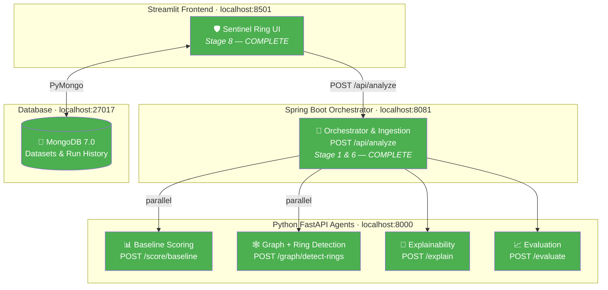

# Sentinel Ring — Project Synopsis

> **Track 2: AI Risk Manager** — Razorpay AI Buildathon
>
> A multi-agent fraud detection system that catches coordinated abuse rings
> by analyzing shared attributes (device, IP, bank account) across accounts,
> rather than scoring transactions individually.

---

## Current Status

| Stage | Component / Agent | Stack | Status |
|-------|-------------------|-------|--------|
| 0 | API Contract | — | ✅ Locked (v4) |
| 1 | **Ingestion Agent** | **Spring Boot** | ✅ **Complete** |
| 2 | **Baseline Scoring Agent** | **Python** | ✅ **Complete** |
| 3 | **Graph-Builder & Ring-Detection Agent** | **Python** | ✅ **Complete (Louvain)** |
| 4 | **Evaluation Agent** | **Python** | ✅ **Complete** |
| 5 | **Explainability Agent** | **Python** | ✅ **Complete** |
| 6 | **Orchestrator Pipeline** | **Spring Boot** | ✅ **Complete** |
| 7 | **MongoDB Persistence** | **Docker / MongoDB 7** | ✅ **Complete** |
| 8 | **Risk Operations Lab UI** | **Streamlit** | ✅ **Complete (7 Pages)** |

---

## Architecture — Current State



**Legend:** 🟢 Green = complete

---

## Stage 1: Ingestion Agent — What Was Built

### Purpose

The Ingestion Agent is the data-cleaning boundary of the system. Everything
upstream (raw CSVs, Kaggle data) is messy and potentially sensitive.
Everything downstream (Python ML agents) receives clean, normalized,
privacy-safe data.

### Key Design Decisions

| Decision | Choice | Rationale |
|----------|--------|-----------|
| Bank reference handling | SHA-256 hash via `BankRefHasher` | API contract requires non-reversible tokens. Raw bank data never leaves the Java side. |
| Null normalization | Blank/empty → explicit `null` | Contract rule: `null` is never treated as shared evidence in the graph. Two accounts with `null` device_id don't get connected. |
| Timestamp parsing | 3 strategies: ISO-8601, simple date, epoch seconds | Real data uses varied formats. IEEE-CIS uses epoch-style; other datasets use ISO dates. |
| Account attribute aggregation | Preserve all observed non-null sets per account (`device_ids`, `ips`, `bank_refs`) | Preserves full graph linkage evidence across multiple transactions for the same account. |
| Malformed row handling | Drop + log warning, don't crash | Graceful degradation: bad rows are counted in `skippedRows` for auditing. |
| Immutable DTOs | `final` fields, no setters on clean DTOs | Clean data should never be mutated after construction. |

### Output Shapes (per API Contract v4)

**CleanTransaction** → sent to `/score/baseline`:
```json
{ "id": "t1", "amount": 4500, "device_id": "d1", "ip": "1.2.3.4", "account_id": "a1" }
```

**CleanAccount** → sent to `/graph/detect-rings`:
```json
{ "account_id": "a1", "device_ids": ["d1"], "ips": ["1.2.3.4"], "bank_refs": ["a3f2b7c9..."] }
```

### Files

| File | Purpose |
|------|---------|
| [`server/pom.xml`](file:///c:/Users/yusuf/OneDrive/Desktop/RazorPay%20AI%20Risk%20Mg/server/pom.xml) | Maven project config (Spring Boot 3.3, Java 17) |
| [`SentinelApplication.java`](file:///c:/Users/yusuf/OneDrive/Desktop/RazorPay%20AI%20Risk%20Mg/server/src/main/java/com/sentinel/SentinelApplication.java) | Spring Boot entry point |
| [`RawTransaction.java`](file:///c:/Users/yusuf/OneDrive/Desktop/RazorPay%20AI%20Risk%20Mg/server/src/main/java/com/sentinel/ingestion/dto/RawTransaction.java) | Raw input DTO (internal only) |
| [`CleanTransaction.java`](file:///c:/Users/yusuf/OneDrive/Desktop/RazorPay%20AI%20Risk%20Mg/server/src/main/java/com/sentinel/ingestion/dto/CleanTransaction.java) | Cleaned transaction DTO |
| [`CleanAccount.java`](file:///c:/Users/yusuf/OneDrive/Desktop/RazorPay%20AI%20Risk%20Mg/server/src/main/java/com/sentinel/ingestion/dto/CleanAccount.java) | Cleaned account DTO |
| [`IngestionResult.java`](file:///c:/Users/yusuf/OneDrive/Desktop/RazorPay%20AI%20Risk%20Mg/server/src/main/java/com/sentinel/ingestion/dto/IngestionResult.java) | Ingestion output wrapper |
| [`BankRefHasher.java`](file:///c:/Users/yusuf/OneDrive/Desktop/RazorPay%20AI%20Risk%20Mg/server/src/main/java/com/sentinel/ingestion/util/BankRefHasher.java) | SHA-256 bank reference hasher |
| [`IngestionService.java`](file:///c:/Users/yusuf/OneDrive/Desktop/RazorPay%20AI%20Risk%20Mg/server/src/main/java/com/sentinel/ingestion/service/IngestionService.java) | Core ingestion logic |

---

## Defense-Only Commitment

> ⚠️ **This system only flags and explains.** It never auto-blocks, auto-bans,
> or takes autonomous action against any account. A human operator reviews
> every flag before any action is taken. The Ingestion Agent specifically
> performs **zero** decision-making — it only cleans and normalizes data.

---

## Stage 2: Baseline Scoring Agent — What Was Built

### Purpose

The Baseline Scoring Agent takes the `CleanTransaction[]` from the Ingestion Agent and returns a risk score (0.0–1.0) per transaction. This is the "quick first pass" — catching individually suspicious transactions before the graph analysis looks for coordinated rings.

### Scoring Heuristic (v1)

```
risk = 0.05 (base)
     + sigmoid(amount) × 0.50   (amount signal)
     + 0.25 if device_id is null (missing device penalty)
     + 0.15 if ip is null         (missing IP penalty)

clamped to [0.0, 1.0]
```

### Files

| File | Purpose |
|------|---------|
| [`server/agents/scoring/models.py`](file:///c:/Users/yusuf/OneDrive/Desktop/RazorPay%20AI%20Risk%20Mg/server/agents/scoring/models.py) | Pydantic request/response models for /score/baseline |
| [`server/agents/scoring/scorer.py`](file:///c:/Users/yusuf/OneDrive/Desktop/RazorPay%20AI%20Risk%20Mg/server/agents/scoring/scorer.py) | Scoring heuristic logic (v1, rule-based) |
| [`server/agents/scoring/router.py`](file:///c:/Users/yusuf/OneDrive/Desktop/RazorPay%20AI%20Risk%20Mg/server/agents/scoring/router.py) | FastAPI router for POST /score/baseline |

---

## Stage 3: Graph-Builder & Ring-Detection Agent — What Was Built

### Purpose

The Graph-Builder & Ring-Detection Agent implements `POST /graph/detect-rings`.
It receives account attribute sets (`device_ids`, `ips`, `bank_refs`), constructs
an weighted NetworkX graph connecting accounts that share non-null attributes,
applies Louvain Community Detection to uncover tightly connected fraud rings,
and computes confidence scores for flagged rings.

### Graph & Clustering Safeguards (Louvain Community Detection)

| Feature | Implementation | Rationale |
|---------|----------------|-----------|
| Algorithm | `networkx.algorithms.community.louvain_communities` with `seed=42` | Ensures deterministic, reproducible community clustering across runs. |
| Edge Weighting | `device_id` = 3, `bank_ref` = 2, `ip` = 1 | Stronger linkage signals drive community formation over weak signals. |
| Minimum Ring Size | `min_ring_size = 3` | Weak 2-account pairs are discarded as rings. |
| Public IP Safeguard | Rings supported solely by shared IP are capped at `ring_score = 0.55` | Shared IP alone cannot trigger the `0.60` ring flagging threshold. |

### Files

| File | Purpose |
|------|---------|
| [`server/agents/graph/models.py`](file:///c:/Users/yusuf/OneDrive/Desktop/RazorPay%20AI%20Risk%20Mg/server/agents/graph/models.py) | Pydantic models for /graph/detect-rings (v4) |
| [`server/agents/graph/detector.py`](file:///c:/Users/yusuf/OneDrive/Desktop/RazorPay%20AI%20Risk%20Mg/server/agents/graph/detector.py) | NetworkX graph construction & Louvain detection algorithm |
| [`server/agents/graph/router.py`](file:///c:/Users/yusuf/OneDrive/Desktop/RazorPay%20AI%20Risk%20Mg/server/agents/graph/router.py) | FastAPI router for POST /graph/detect-rings |

---

## Stage 4 & 5: Evaluation & Explainability Agents

- **Evaluation Agent (`POST /evaluate`)**: Calculates precision, recall, and false-positive cost against held-out ground truth. Includes ID alignment validation and vacuous metric handling.
- **Explainability Agent (`POST /explain`)**: Generates plain-English evidence explanations for human risk reviewers (e.g., *"Flagged ring ring-1: 3 accounts share the same device fingerprint within a 3-day window"*).

---

## Stage 6: Orchestrator Pipeline

Spring Boot REST Controller (`POST /api/analyze` on port 8081) wiring all agents into an end-to-end pipeline:
1. Ingests raw data & hashes bank account references.
2. Invokes `/score/baseline` and `/graph/detect-rings` in parallel via JDK HTTP/1.1 client.
3. Merges risk scores (MAX per account) and ring membership.
4. Invokes `/explain` for flagged rings.
5. Evaluates against ground truth if supplied.

---

## Stage 7 & 8: MongoDB Persistence & Risk Operations Lab UI

### Purpose

A SaaS-style risk operations dashboard allowing risk analysts to upload transaction datasets, simulate synthetic fraud scenarios, inspect graph connections, evaluate held-out metrics, and manage historical analysis runs.

### 7-Page Operations Lab Structure

| Page | Purpose | Key Features |
|------|---------|--------------|
| 📊 **Overview** | Executive Dashboard | 5 KPI cards, risk distribution histogram, flagged ratio donut chart, ring size bar chart, verdict summary table. |
| 🧪 **Dataset Lab** | File Ingestion & Execution | CSV/JSON uploader, column alias detection, dataset quality metrics, ground truth toggle, analysis execution. |
| ⚡ **Payment Simulator** | Synthetic Scenario Sandbox | Presets (*Clean*, *Shared Device*, *Multi-Signal Ring*, *IP Cluster*, *Mixed*, *Custom*), instant execution, live results. |
| 🕸️ **Ring Explorer** | Interactive Network Graph | PyVis network graph, node sizing by risk, link color by attribute, risk score filters, member inspect table. |
| 🎯 **Evaluation** | Ground Truth Evaluation | Precision/Recall/F1 KPIs, 2x2 confusion matrix heatmap, per-account breakdown table, FP cost config. |
| 📜 **Run History** | Persistent Audit Trail | MongoDB run list, date search, load into session, export (CSV/JSON/Markdown), delete controls. |
| ⚙️ **Settings** | Configuration & Health | Threshold sliders, FP cost default, service health indicators (`:8081`, `:27017`), storage purge actions. |

---

## Test Coverage Summary

- **Python Agents**: `46/46` unit tests passed (`pytest`).
- **Java Orchestrator**: Maven test compile succeeded cleanly.
- **Streamlit Frontend**: `28/28` Python files compiled cleanly with 0 syntax errors.
